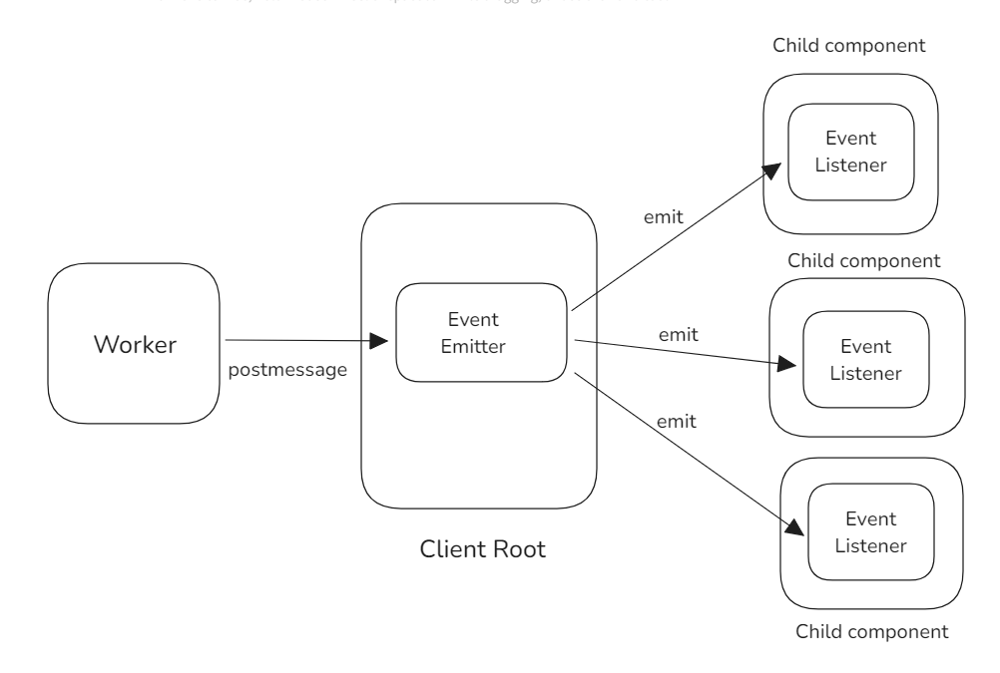

# Problem Statement

***Context: developing a website/web app/browser extension with the current generation browser
API***

When handling messages from web workers, you might encounter a scenario where multiple
message listeners exist. For instance, a generic one might be at the application's root level, and
another might be within a specific component.
This setup can lead to a problem where the message is intercepted at the root level and fails to
reach the component-level listener. Considering this issue, how would you approach and
resolve such a conflict in a robust and scalable way?
Describe potential strategies or design patterns to ensure messages reach the intended
listener(s).

# Solution Design

The problem that is caused due to root component swallowing up messages could be solved by an event emitter pattern as shown in the above diagram.

## Solution Codebase

In the solution designed, there is a root component, and a child/sub component which need to subscribe to messages from a worker, and have actions to perform on receiving them.
Instead of registering multiple onmessage worker event listeners at every level, which would result in the problem statement, an event emitter could be used which would capture the worker message, and emit the same for all of it's listeners.

[EventEmitter.js](src/EventEmitter.js)

A custom event emitter, which can listen to and emit events is instantiated and exported from this module. This could ideally be a singleton to ensure all the child/sub components register listeners on the same instance.  

[Root Component](src/App.jsx)

In the codebase, the root component registers the worker and starts listening for messages from it using the worker.onmessage event handler. This root component imports the event emitter instance, and uses it to emit worker specific event from the worker.onmessage listener.

On the component mount, a useEffect hook uses the same event emitter instance to setup a listener for worker events at the root level, and implements a cleanup function which removes this listener when the component unmounts.

[Child Component](src/components/Child.jsx)

On the component mount, a useEffect hook uses the same event emitter instance to setup a listener for worker events at the sub component level, and implements a cleanup function which removes this listener when the component unmounts.

## Solution Flow

When the worker posts a message to the main thread, the worker.onmessage event handler subscribed to this message activates and uses the eventEmitter.emit to notify it's subscribers about the worker message. 
The listeners registered at the root level and sub component level for this event from the event emitter capture this event, and in turn calls the respective event handlers. This way, the solution navigates it's way around worker messages not reaching all the intended subscribers.